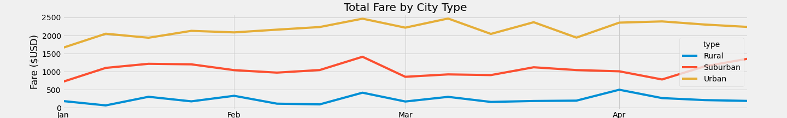

# PyBer Analysis

## Overview of PyBer Analysis
### Purpose of Analysis
For this project, I was tasked with analyzing data from a python based ride-sharing app called Pyber.  The purpose of the analysis was to showcase the relationship between the type of city (Urban, Suburban and Rural) and number of drivers and riders, as well as fares by city type.  The data is to be used to improve access to ride-share services and improve affordability for under-served neighborhoods.

In this analysis in particular, the goal was to create compelling visualizations of the data that was aggregated.

### Resources
- Data Sources: city_data.csv, ride_data.csv
- Software: Python 3.8.8, Jupyter notebook 6.4.0, Jupyter lab 3.0.16
- Python libraries: matplotlib, pandas

## Results
### Summary
As seen in the summary DataFrame below, there are stark differences in PyBer metrics based on city type.  For example, total rides, total drivers and total fares are markedly higher in urban cities than suburban or rural.  Rural cities, predictably, have the lowest number of available drivers, rides and bring in the least revenue.

Noticably, the average fare per driver is highest in rural areas.  So while there are fewer riders, and fewer drivers, the drivers in these cities are not only charging more per ride (perhaps because of longer distances?) but are also earning more per driver than in other city types.

Perhaps due to the large number of drivers in urban cities (almost three times suburban cities), the average fare per driver is significantly lower then the average fare per ride.

Total Fares were studied by City Type for the months between January 2019 and April 2019.  The line chart below shows the total fares by city type for this four-month time period.

### Recommendations
Based on the results, provide three business recommendations to the CEO for addressing any disparities among the city types.
