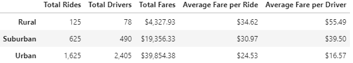

# PyBer Analysis

## Overview of PyBer Analysis
### Purpose of Analysis
For this project, I was tasked with analyzing data from a python based ride-sharing app called Pyber.  The purpose of the analysis was to showcase the relationship between the type of city (Urban, Suburban and Rural) and number of drivers and riders, as well as fares by city type.  The data is to be used to improve access to ride-share services and improve affordability for under-served neighborhoods.

In this analysis in particular, the goal was to create compelling visualizations of the data that was aggregated.

### Resources
- Data Sources: city_data.csv, ride_data.csv
- Software: Python 3.8.8, Jupyter notebook 6.4.0, Jupyter lab 3.0.16
- Python libraries: matplotlib, pandas

## Results
### Summary
As seen in the summary DataFrame below, there are stark differences in total rides, drivers and fares based on city type.

Using images from the summary DataFrame and multiple-line chart, describe the differences in ride-sharing data among the different city types

### Recommendations
Based on the results, provide three business recommendations to the CEO for addressing any disparities among the city types.
